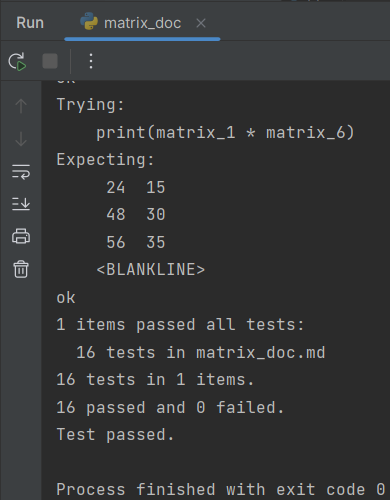
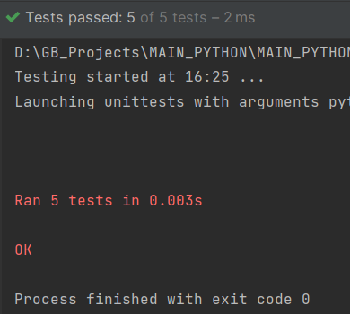
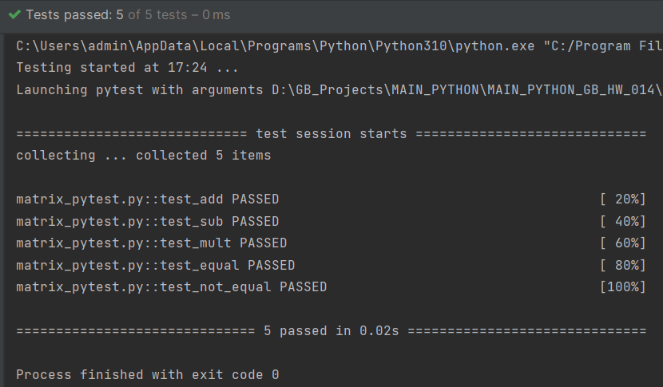

# Погружение в Python. Основы тестирования

Возьмите 1-3 задачи из тех, что были на прошлых семинарах или в домашних заданиях.
Напишите к ним тесты. 2-5 тестов на задачу в трёх вариантах:
* doctest
* unittest
* pytest

В качестве основы для выполнения задания используем задачи семинара 11 - работа с матрицами.

Подготовим описание тестов в test_matrix.md для проверки работы с матрицами через doctest.

**Итог выполнения тестов**

doctest: 

unittest:

pytest:

    

